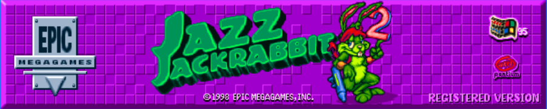

# TP Jazz Jackrabbit 2



## Trabajo Práctico Final de la materia Taller de Programación I.

| **Integrantes** | **Padrón** | **Email** |
| :-------------: | :--------: | :-------: |
| Buono, Fernando | 103523 | <fbuono@fi.uba.ar> |
| Duca, Francisco | 106308 | <fduca@fi.uba.ar> |
| Oshiro, Lucas | 107024 | <loshiro@fi.uba.ar> |
| Shiao, Tomás Jorge | 106099 | <tshiao@fi.uba.ar> |

## Informes

Los sprites fueron obtenidos desde [aquí](https://www.spriters-resource.com/pc_computer/jazzjackrabbit2thesecretfiles/), mientras que se usan los sonidos obtenidos desde [aquí](https://www.sounds-resource.com/pc_computer/jazzjackrabbit/sound/18894/) y la tipografía se descargó desde [esta fuente](https://www.jazz2online.com/downloads/2974/jazz-jackrabbit-2-font/).

## Dependencias

Comando completo para configurar y construir sh
# Actualizar los repositorios
```sh
sudo apt-get update
```

# Instalar las bibliotecas necesarias de Qt5, yaml-cpp y SDL2_image
```sh
sudo apt-get install qtbase5-dev qtdeclarative5-dev qt5-qmake qttools5-dev-tools
sudo apt-get install libyaml-cpp-dev
sudo apt-get install libsdl2-image-dev
sudo apt-get install libfmt-dev
```

# Crear y entrar al directorio de compilación 
```sh
mkdir build
cd build
```

# Configurar el proyecto con CMake
```sh
cmake ..
```

# Compilar el proyecto
```sh
make -j$(nproc)
```
# Ejecutar el cliente
```sh
./jazzclient localhost 8080
```
# Ejecutar el servidor
```sh
./jazzserver 8080
```
# Ejecutar las pruebas (en /build)
```sh
cmake .. -DTESTING=ON 
make -j$(nproc)
./Tests/tests
```

# Descripción General del Proyecto

El proyecto es una implementación del juego Jazz Jackrabbit 2 con soporte multijugador. Los jugadores pueden seleccionar uno de los tres personajes: Jazz, Spaz o Lori, cada uno con habilidades y ataques especiales únicos. El juego incluye la capacidad de disparar, correr, saltar y realizar ataques especiales, así como varios estados como intoxicado, recibir daño y muerte.

## Componentes Principales

### Cliente

- **Lobby**: Maneja la selección de personajes, la creación de juegos y la lista de juegos disponibles.
- **SDL**: Maneja la visualización del juego y la lógica de los personajes y enemigos.
- **Protocol**: Maneja la serialización y deserialización de los mensajes entre el cliente y el servidor.
- **Threads**: Maneja los hilos de recepción y envío de comandos.

### Servidor

- **Game**: Maneja la lógica del juego, incluyendo la actualización de personajes, enemigos y el mapa del juego.
- **Protocol**: Maneja la serialización y deserialización de los mensajes entre el servidor y el cliente.
- **Threads**: Maneja los hilos de recepción y envío de comandos y la lógica del juego.

### Común

- **Config**: Contiene la configuración del cliente y del servidor.
- **DTO**: Define los objetos de transferencia de datos utilizados en la comunicación entre el cliente y el servidor.
- **Types**: Define los tipos utilizados en el juego, como personajes, comandos, direcciones, etc.

## Configuración del Juego

La configuración del juego se maneja a través de archivos YAML ubicados en el directorio `config`. Estos archivos definen varios parámetros del juego, como la salud inicial de los personajes, los tiempos de resurrección, la velocidad de movimiento, etc.

## Ejecución del Juego

Para ejecutar el juego, primero debe compilarse utilizando CMake. Una vez compilado, se pueden iniciar el cliente y el servidor con los siguientes comandos:

```sh
./jazzclient localhost 8080
./jazzserver 8080
```

# Licencia
Este proyecto está licenciado bajo la Licencia MIT. Para más detalles, consulta el archivo LICENSE.
