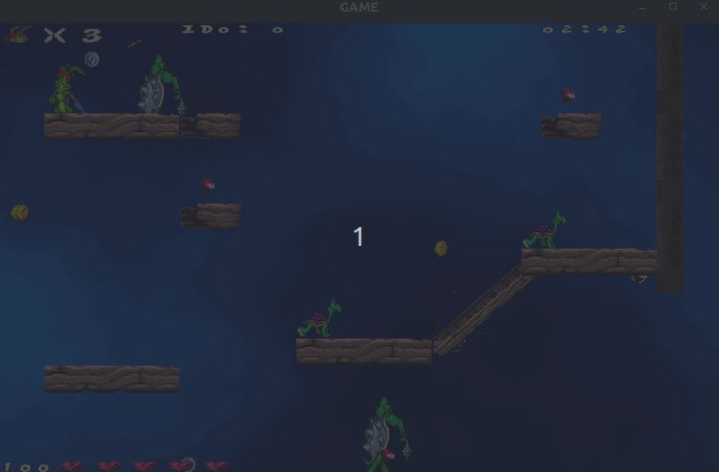

# TP Jazz Jackrabbit 2


## Trabajo Práctico Final de la materia Taller de Programación I

| **Integrantes** | **Padrón** | **Email** |
| :-------------: | :--------: | :-------: |
| Buono, Fernando | 103523 | <fbuono@fi.uba.ar> |
| Duca, Francisco | 106308 | <fduca@fi.uba.ar> |
| Oshiro, Lucas | 107024 | <loshiro@fi.uba.ar> |
| Shiao, Tomás Jorge | 106099 | <tshiao@fi.uba.ar> |

## Informes

Los sprites fueron obtenidos desde [aquí](https://www.spriters-resource.com/pc_computer/jazzjackrabbit2thesecretfiles/), mientras que se usan los sonidos obtenidos desde [aquí](https://www.sounds-resource.com/pc_computer/jazzjackrabbit/sound/18894/) y la tipografía se descargó desde [esta fuente](https://www.jazz2online.com/downloads/2974/jazz-jackrabbit-2-font/).

[Manual de Proyecto](src/Documentation/build/Manual-de-Proyecto.pdf)
[Documentación Técnica](src/Documentation/build/Documentacion-Tecnica.pdf)
[Manual de Usuario](src/Documentation/build/Manual-de-Usuario.pdf)

## Dependencias

Comando completo para configurar y construir sh

### Actualizar los repositorios

```sh
sudo apt-get update
```

### Instalar las bibliotecas necesarias

Para esto, se provee un archivo, `installer.sh`, que contiene todas las dependencias para compilar el proyecto. Para ello, se puede instalar o bien via el script:

```sh
sudo chmod +x installer.sh
./installer.sh
```

o bien instalarlo manualmente:

```sh
sudo apt-get install -y build-essential cmake git libyaml-cpp-dev libfmt-dev
sudo apt-get install -y libgl1-mesa-dev libglu1-mesa-dev libglew-dev
sudo apt-get install -y libjpeg-dev libpng-dev libfreetype-dev libopusfile-dev libflac-dev libxmp-dev libfluidsynth-dev libwavpack-dev cmake libmodplug-dev
sudo apt-get install -y libgl-dev libegl-dev libfontconfig1-dev libinput-dev libfontconfig1-dev libfreetype6-dev libx11-dev libx11-xcb-dev libxext-dev libxfixes-dev libxi-dev libxrender-dev libxcb1-dev libxcb-cursor-dev libxcb-glx0-dev libxcb-keysyms1-dev libxcb-image0-dev libxcb-shm0-dev libxcb-icccm4-dev libxcb-sync-dev libxcb-xfixes0-dev libxcb-shape0-dev libxcb-randr0-dev libxcb-render-util0-dev libxcb-util-dev libxcb-xinerama0-dev libxcb-xkb-dev libxkbcommon-dev libxkbcommon-x11-dev

sudo apt-get install -y qtbase5-dev qtchooser qt5-qmake qtbase5-dev-tools
sudo apt-get install -y libqt5widgets5 libqt5gui5 libqt5dbus5 libqt5network5 libqt5core5a

sudo apt-get install -y libsdl2-dev libsdl2-image-dev libsdl2-mixer-dev libsdl2-ttf-dev

sudo apt-get install -y libgtest-dev libgmock-dev
cd /usr/src/googletest
sudo cmake .
sudo make
sudo make install

# Actualizar el cache
sudo ldconfig
```

### Instalar la tipografía

Para instalar la tipografía utilizada, se debe ejecutar esta línea de codigo, asumiendo que se encuentra en el directorio principal. Si no, ajustar el primer parámetro.

```sh
sudo cp ./assets/Miscellaneous/Jazz-Jackrabbit-2.ttf /usr/share/fonts/
```

### Crear y entrar al directorio de compilación

```sh
mkdir build
cd build
```

### Configurar el proyecto con CMake

```sh
cmake ..
```

### Compilar el proyecto

```sh
make -j$(nproc)
```

### Ejecutar el cliente

```sh
./jazzclient localhost 8080
```

### Ejecutar el servidor

```sh
./jazzserver 8080
```

### Ejecutar las pruebas (en /build)

```sh
cmake .. -DTESTING=ON 
make -j$(nproc)
./Tests/tests
```

## Descripción General del Proyecto

El proyecto es una implementación del juego Jazz Jackrabbit 2 con soporte multijugador. Los jugadores pueden seleccionar uno de los tres personajes: Jazz, Spaz o Lori, cada uno con habilidades y ataques especiales únicos. El juego incluye la capacidad de disparar, correr, saltar y realizar ataques especiales, así como varios estados como intoxicado, recibir daño y muerte.

### Componentes Principales

#### Cliente

##### Lobby

El lobby maneja la selección de personajes, la creación de juegos y la lista de juegos disponibles.

El Lobby es donde el jugador selecciona si quiere crear una partida o unirse a un juego ya existente, así como donde selecciona su personaje.
La configuración del juego solicita que el usuario elija primero un mapa y luego un nombre y cantidad de jugadores de la partida.

Posee el siguiente flujo:


##### SDL

Maneja la visualización del juego y la lógica de los personajes y enemigos.





##### Protocol

Maneja la serialización y deserialización de los mensajes entre el cliente y el servidor.

##### Threads

Maneja los hilos de recepción y envío de comandos.

#### Servidor

- **Game**: Maneja la lógica del juego, incluyendo la actualización de personajes, enemigos y el mapa del juego.
- **Protocol**: Maneja la serialización y deserialización de los mensajes entre el servidor y el cliente.
- **Threads**: Maneja los hilos de recepción y envío de comandos y la lógica del juego.

#### Común

- **Config**: Contiene la configuración del cliente y del servidor.
- **DTO**: Define los objetos de transferencia de datos utilizados en la comunicación entre el cliente y el servidor.
- **Types**: Define los tipos utilizados en el juego, como personajes, comandos, direcciones, etc.

#### Editor de Niveles

El editor de niveles ofrece al usuario la posibilidad de crear sus propios mapas para el juego.
Permite posicionar a gusto los distintos elementos que contiene el juego, como personajes, enemigos, obstáculos e ítems.

Posee una lista de elementos a derecha y a izquierda, un canvas sobre al cual se le pueden arrastrar elementos.


Para que se cree un mapa, se debe ingresar un nombre y el canvas debe tener elementos.
De cumplirse estas condiciones, y que el nombre del mapa no sea uno existente, se crea el mapa en formato YAML y se guarda en el servidor.


### Configuración del Juego

La configuración del juego se maneja a través de archivos YAML ubicados en el directorio `config`. Estos archivos definen varios parámetros del juego, como la salud inicial de los personajes, los tiempos de resurrección, la velocidad de movimiento, etc.

### Ejecución del Juego

Para ejecutar el juego, primero debe compilarse utilizando CMake. Una vez compilado, se pueden iniciar el cliente y el servidor con los siguientes comandos:

```sh
./jazzclient <ip> <puerto>
./jazzserver <puerto>
```

### Ejecución con Vagrant

El proyecto también cuenta con un Vagrantfile que permite la ejecución del mismo. Para ello, se requiere que el usuario tenga instalado Vagrant.

#### Ejecución

Para ejecutar el programa usándo esta herramienta:

```sh
vagrant up --provision
vagrant ssh
cd /home/vagrant/jazz_jackrabbit_2/build
```

En el caso de querer ejecutar el server:

```sh
./jazzserver <port>
```

Si se quiere ejecutar el cliente:

```sh
./jazzclient <ip> <port>
```

Para deterner la ejecución, se debe usar:

```sh
exit
vagrant halt
```

Finalmente, para desinstalar la máquina virtual o reiniciar desde cero:

```sh
vagrant destroy
```

## Licencia

Este proyecto está licenciado bajo la Licencia MIT. Para más detalles, consulta el archivo LICENSE.
